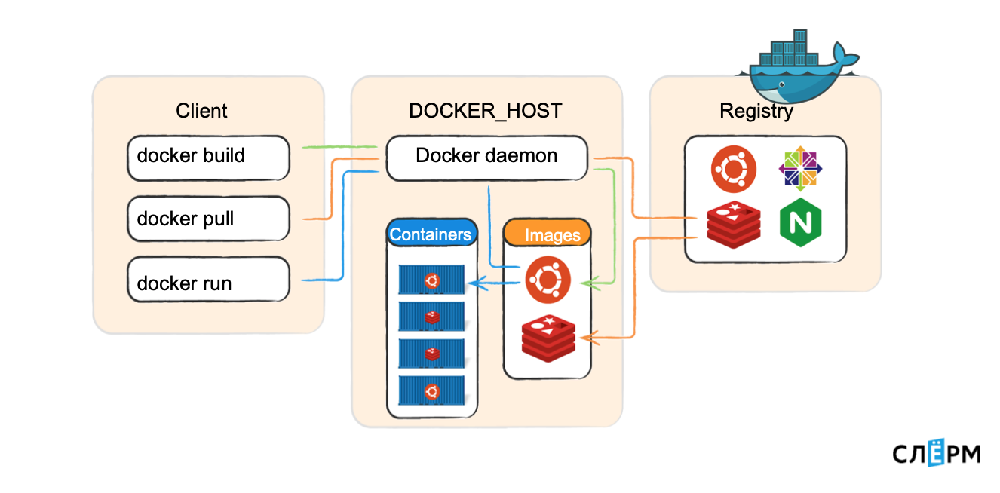

# Начало

## Принципы микросервисности

#### Стейтлес
Конфигурация контейнера не может и не должна меняться после запуска.

#### Чистый (pure)
docker позволят контейнерам общаться, но только строго задекларированными способами.

#### Ленивый
Контейнер всего-лишь создает пустую файловую систему поверх образа. В docker'е это называется слоем.

#### Декларативный
Все свойства контейнера хранятся в декларативном виде

#### Функциональный
Предполагается, что в контейнере будет жить всего один процесс (можно с семьёй), выполняющий всего одну функцию в приложении.

#### Строгий
docker запрещает контейнеру всё, кроме доступа в сеть

## Составные части Docker

#### docker daemon
Это асинхронный HTTP-сервер

#### docker
Это CLI, работающий по HTTP с docker daemon 

#### Dockerfile
Текстовая инструкция по тому, как собирать образ

#### Image
Образ, из которого раскатывается контейнер

#### Container
Контейнер =)

#### Docker Registry
Хранилище Docker образов

## Изоляция
#### Namespaces
PID, Networking, Mount и User
#### Control Groups 
Memory, CPU, IOPS, Network

# Практика
## 01
Простейшая сборка образа и запуск контейнера

## 02
Указатель дирректории при сборке

## 03
Слои

## 04
Workdir и path внутри контейнера

## 05
Функция RUN

## 06
Функция CMD

## 07
Функция ENV

## 08
Функция ENTRYPOINT

## 09
Unnamed Volumes

## 10
Named Volumes

## 11
Network Bridge

## 12
Network Host

## 13
Network Macvlan

## 14
###### Полезные функции
logs, exec, filters, start, stop, images, -q, inspect
